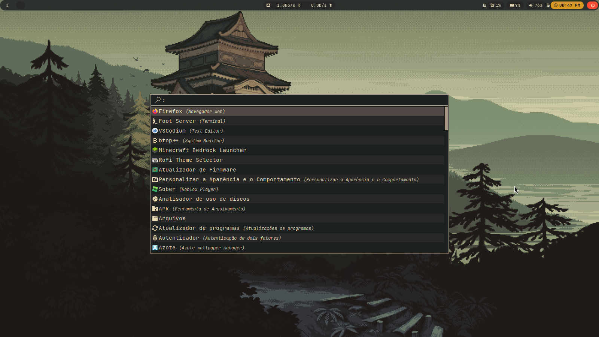
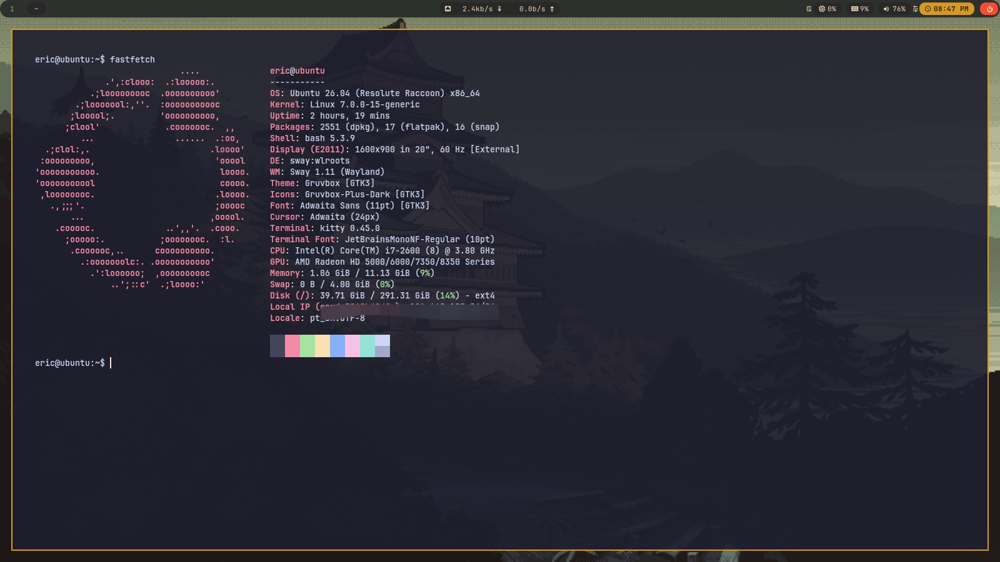
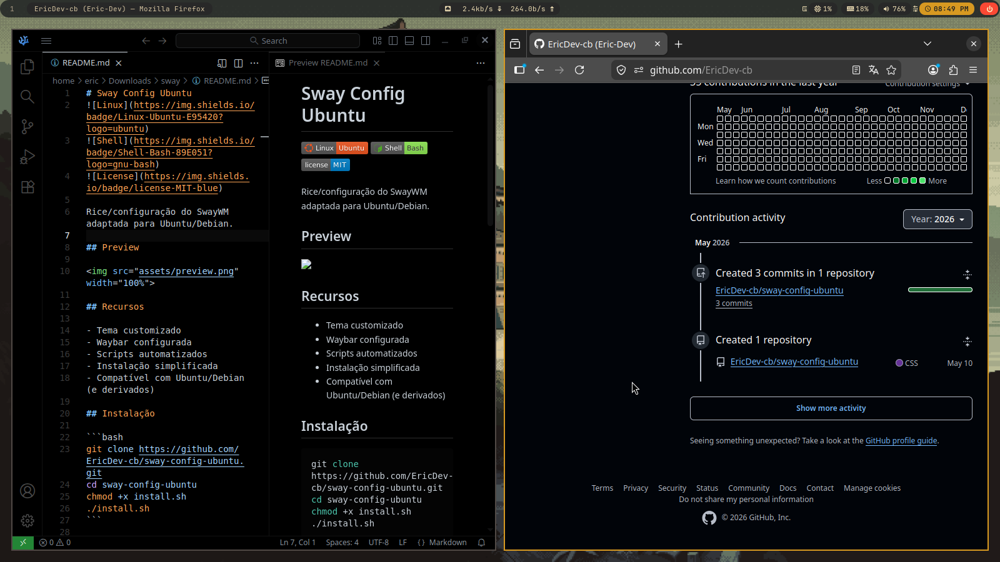

# Sway Config Ubuntu

Rice/configuração do SwayWM adaptada para Ubuntu/Debian.


## Preview

<p align="center">
  
</p>

---

## Recursos

- Instalação automatizada
- Configuração pronta do SwayWM
- Waybar customizada
- Rofi tematizado
- Tema GTK incluso
- Scripts utilitários
- Compatível com Ubuntu/Debian

---

## Instalação

```bash
git https://github.com/EricDev-cb/sway-config-ubuntu.git
cd sway-config-ubuntu
chmod +x install.sh
./install.sh
```

---

## Dependências

O instalador cuida da maior parte automaticamente.

Principais componentes:

- sway
- waybar
- rofi
- foot
- grim
- slurp
- wl-clipboard

---

## Screenshots

### Desktop


### Waybar



### Terminal



### Workspace



---
## Keybindings

| Atalho | Ação |
|---|---|
| `SUPER + Enter` | Abrir terminal |
| `SUPER + D` | Abrir launcher |
| `SUPER + Shift + D` | Abrir menu |
| `SUPER + Q` | Fechar janela |
| `SUPER + F` | Fullscreen |
| `SUPER + Space` | Toggle floating |
| `SUPER + E` | Abrir explorador de arquivos |
| `SUPER + B` | Abrir navegador |
| `SUPER + C` | Abrir calculadora |
| `SUPER + 1-0` | Alternar workspaces |
| `SUPER + Shift + 1-0` | Mover janela para workspace |
| `Print` | Screenshot de seleção |
| `Ctrl + Print` | Screenshot da janela |
| `Shift + Print` | Screenshot do monitor |
| `SUPER + Shift + Q` | Fechar Sway |

## Objetivo

Facilitar a instalação e uso de um ambiente Sway moderno no Ubuntu/Debian sem precisar configurar tudo manualmente.

---

## Licença

MIT

---

